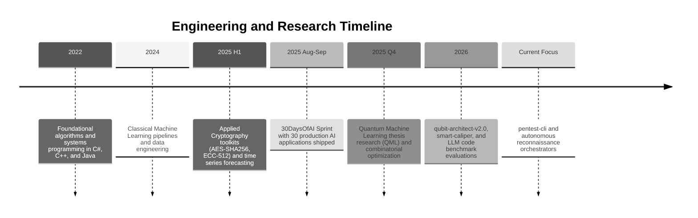

<div align="center">

  <!-- Header Banner -->
  

  <!-- Animated Dynamic Typing (Zero Emoji) -->
  <picture>
    <source media="(prefers-color-scheme: dark)" srcset="https://readme-typing-svg.demolab.com?font=Fira+Code&weight=600&size=20&duration=3000&pause=1000&color=38BDF8&center=true&vCenter=true&width=650&lines=Security-Minded+AI+Engineer;Applied+Machine+Learning+%26+Computer+Vision;Autonomous+Reconnaissance+%26+Security+Orchestration;Quantum+Machine+Learning+%26+Optimization;30+Days+of+AI+Challenge+Graduate;Human-in-the-Loop+System+Architect">
    <source media="(prefers-color-scheme: light)" srcset="https://readme-typing-svg.demolab.com?font=Fira+Code&weight=600&size=20&duration=3000&pause=1000&color=0369A1&center=true&vCenter=true&width=650&lines=Security-Minded+AI+Engineer;Applied+Machine+Learning+%26+Computer+Vision;Autonomous+Reconnaissance+%26+Security+Orchestration;Quantum+Machine+Learning+%26+Optimization;30+Days+of+AI+Challenge+Graduate;Human-in-the-Loop+System+Architect">
    
  </picture>

  <br/>

  <p align="center">
    <a href="#terminal-session">Terminal</a> &bull;
    <a href="#featured-projects">Projects</a> &bull;
    <a href="#architecture--pentest-cli">Architecture</a> &bull;
    <a href="#tech-stack--tooling">Tech Stack</a> &bull;
    <a href="#the-30-days-of-ai-sprint-spotlight">30DaysOfAI</a> &bull;
    <a href="#engineering-milestones">Milestones</a> &bull;
    <a href="#turkish-summary">Turkce Ozet</a>
  </p>

  <p align="center">
    
    
    
    
  </p>

</div>

---

### Professional Network & Profiles

<div align="center">

  <a href="https://www.linkedin.com/in/suleyman-toklu10" target="_blank">
    
  </a>
  <a href="https://www.kaggle.com/tiheli" target="_blank">
    
  </a>
  <a href="https://huggingface.co/tiheli" target="_blank">
    
  </a>
  <a href="https://medium.com/@sulotkl" target="_blank">
    
  </a>
  <a href="mailto:toklusuleyman24@gmail.com">
    
  </a>

</div>

---

### Terminal Session

```bash
suleyman@devsecops-lab:~$ whoami
+-----------------------------------------------------------------------------+
|  Name: Suleyman Toklu                                                       |
|  Role: Security-Minded AI Engineer                                          |
|  Base: Isparta University of Applied Sciences (ISUBU), Computer Engineering |
|  Focus: External Recon Automation, Explainable Pentest AI, Quantum ML       |
+-----------------------------------------------------------------------------+

suleyman@devsecops-lab:~$ cat core_philosophy.json
{
  "mission": "Automate repetitive recon tasks, maintain human control over critical decisions, report with clarity.",
  "active_initiatives": [
    "pentest-cli -> Human-in-the-loop external penetration testing orchestrator",
    "smart-caliper -> Sub-pixel computer vision metrology and defect inspection",
    "qubit-architect-v2.0 -> Benchmark platform for Quantum ML vs Classical ML",
    "LLM-Comparison-Benchmarking -> Controlled evaluation of code generation models"
  ],
  "milestone": "30DaysOfAI -> 30 production AI applications shipped across 30 consecutive days"
}
```

---

### Featured Projects

<div align="center">

| Status | Project | Focus & Technical Innovation | Stack | Repository |
|:---:|:---|:---|:---|:---:|
|  | **[`pentest-cli`](https://github.com/SuleymanToklu/pentest-cli)** | Human-in-the-loop web penetration testing orchestrator. Autonomous LLM justification before scans with strict approval gates. | `Python` `Security` `LLM` | [Repository](https://github.com/SuleymanToklu/pentest-cli) |
|  | **[`smart-caliper`](https://github.com/SuleymanToklu/smart-caliper)** | Sub-pixel computer vision metrology and automated manufacturing defect inspection engine. | `Python` `OpenCV` `Metrology` | [Repository](https://github.com/SuleymanToklu/smart-caliper) |
|  | **[`LLM-Comparison-Benchmarking`](https://github.com/SuleymanToklu/LLM-Comparison-Benchmarking)** | Controlled benchmark comparing code-generation models on architectural constraints, contracts, and adversarial tests. | `Next.js` `TypeScript` `Python` | [Repository](https://github.com/SuleymanToklu/LLM-Comparison-Benchmarking) |
|  | **[`QML`](https://github.com/SuleymanToklu/QML)** | Comparative performance evaluation of quantum machine learning algorithms using Qiskit (BSc Thesis). | `Qiskit` `Python` `QML` | [Repository](https://github.com/SuleymanToklu/QML) |
|  | **[`qubit-architect-v2.0`](https://github.com/SuleymanToklu/qubit-architect-v2.0)** | Interactive web platform for benchmarking hybrid classical and quantum variational machine learning circuits. | `TypeScript` `React` `Next.js` | [Repository](https://github.com/SuleymanToklu/qubit-architect-v2.0) |
|  | **[`30DaysOfAI`](https://github.com/SuleymanToklu/30DaysOfAI)** | Central showcase for the 30-day AI marathon. 30 distinct ML and DL models deployed live to Streamlit and Hugging Face. | `Python` `Streamlit` `Gradio` | [Repository](https://github.com/SuleymanToklu/30DaysOfAI) |

</div>

---

### Live CLI Execution Pattern — `pentest-cli`

```text
$ pentest-cli --target target.example.com --scope authorized_domains.txt --mode assisted

[*] [PHASE 1: PASSIVE RECON]
    Running subfinder and asset discovery...
    [OK] 23 live subdomains discovered across target scope.

[*] [PHASE 2: ACTIVE PROBING]
    Running httpx and selective port telemetry...
    [OK] Active web services identified on ports 80, 443, 8080, 8443.

[*] [LLM AGENT RATIONALE]
    Identified legacy admin endpoint on staging.target.example.com:8443 with TLSv1.0.
    Recommended action: Execute selective configuration check template.
    Strict constraint: Zero aggressive fuzzing or denial-of-service payloads permitted.

[?] ACTION REQUIRED: Approve scan on target port 8443? [y/N]: y
    [>] Executing verified template bundle...
    [OK] Scan finalized. Zero unauthorized exploits executed.

[*] [EXPORT] Executive summary written to ./reports/2026-09-pentest-summary.md
```

---

### Architecture — `pentest-cli`

```mermaid
%%{init: {'theme': 'neutral', 'themeVariables': {'fontFamily': 'ui-monospace, SFMono-Regular, Menlo, Monaco, Consolas, monospace'}}}%%
flowchart LR
    subgraph S1 [Phase 1: Authorization]
      A[Scope Target & Written Authorization]
    end

    subgraph S2 [Phase 2: Discovery Engine]
      B[Passive Reconnaissance<br/>subfinder & assetfinder]
      C[Active Probing<br/>httpx & nmap telemetry]
    end

    subgraph S3 [Phase 3: Vulnerability Intel]
      D[Vulnerability Assessment<br/>nuclei & configuration checks]
      P[LLM Agent Reasoning<br/>Tool Selection Rationale]
    end

    subgraph S4 [Phase 4: Human Gate & Report]
      H[Human-in-the-Loop Verification<br/>Operator Review & Approval]
      R[Executive Report Generation<br/>Findings & Remediation]
    end

    A --> B
    B --> C
    C --> D
    D --> P
    P --> H
    H -->|Approved| R
    H -->|Revise / Refine| P
```



---

### The 30 Days of AI Sprint Spotlight

Between August and September 2025, I completed the **30 Days of AI Challenge**: 30 distinct AI/ML applications built, trained, and deployed in 30 consecutive days.

<div align="center">

| Day | Project Name | Focus & Domain | Link |
|:---:|:---|:---|:---:|
| **Day 30** | **AI Swiss Army Knife** | Multi-tool AI suite integrating text, image, and tabular intelligence | [Inspect Day 30](https://github.com/SuleymanToklu/Day30-AI-Swiss-Army-Knife) |
| **Day 29** | **AI-Supported Sniper Lab** | Computer vision targeting analysis and trajectory prediction model | [Inspect Day 29](https://github.com/SuleymanToklu/Day-29-AI-Supported-Sniper-Lab) |
| **Day 28** | **Transformer Explorer** | Interactive attention map visualizer and transformer decoder explorer | [Inspect Day 28](https://github.com/SuleymanToklu/Day28-Transformer-Explorer) |
| **Day 26** | **AI Music Studio** | Audio synthesis and neural music genre composition engine | [Inspect Day 26](https://github.com/SuleymanToklu/Day26-AI-Music-Studio) |
| **Day 23** | **AI Image Generator** | Generative latent diffusion pipeline with interactive prompt tuning | [Inspect Day 23](https://github.com/SuleymanToklu/Day23-AI-Image-Generator) |
| **Day 14** | **YOLO Object Detection** | High-throughput real-time object detection and spatial classification | [Inspect Day 14](https://github.com/SuleymanToklu/Day14-YOLO-Object-Detection) |

Explore all 30 production applications on the central hub repository: [30DaysOfAI](https://github.com/SuleymanToklu/30DaysOfAI)

</div>

---

### Tech Stack & Tooling

<div align="center">

#### Languages & Core Scripting
<picture>
  <source media="(prefers-color-scheme: dark)" srcset="https://skillicons.dev/icons?i=python,typescript,javascript,cs,java,cpp,bash&theme=dark">
  <source media="(prefers-color-scheme: light)" srcset="https://skillicons.dev/icons?i=python,typescript,javascript,cs,java,cpp,bash&theme=light">
  
</picture>

<br/><br/>

#### AI / ML & Computational Science
<picture>
  <source media="(prefers-color-scheme: dark)" srcset="https://skillicons.dev/icons?i=tensorflow,pytorch,sklearn,pandas,numpy,opencv&theme=dark">
  <source media="(prefers-color-scheme: light)" srcset="https://skillicons.dev/icons?i=tensorflow,pytorch,sklearn,pandas,numpy,opencv&theme=light">
  
</picture>
<p>
  
  
  
  
</p>

#### Web & Applications
<picture>
  <source media="(prefers-color-scheme: dark)" srcset="https://skillicons.dev/icons?i=fastapi,react,nextjs,tailwind,html,css&theme=dark">
  <source media="(prefers-color-scheme: light)" srcset="https://skillicons.dev/icons?i=fastapi,react,nextjs,tailwind,html,css&theme=light">
  
</picture>
<p>
  
  
</p>

#### Security, Recon & Infrastructure
<picture>
  <source media="(prefers-color-scheme: dark)" srcset="https://skillicons.dev/icons?i=linux,docker,git,github,githubactions,postman&theme=dark">
  <source media="(prefers-color-scheme: light)" srcset="https://skillicons.dev/icons?i=linux,docker,git,github,githubactions,postman&theme=light">
  
</picture>
<p>
  
  
  
</p>

</div>

---

### GitHub Metrics & Activity

<div align="center">

  <p>
    
    
    
  </p>

  <picture>
    <source media="(prefers-color-scheme: dark)" srcset="https://streak-stats.demolab.com/?user=SuleymanToklu&theme=tokyonight&hide_border=true">
    <source media="(prefers-color-scheme: light)" srcset="https://streak-stats.demolab.com/?user=SuleymanToklu&theme=default&hide_border=true">
    
  </picture>

</div>

---

### Engineering Milestones



---

<details id="turkish-summary">
<summary><b>Turkce Profil Ozeti ve Hakkimda (Genisletmek icin tiklayin)</b></summary>
<br/>

### Hakkimda
Isparta Uygulamali Bilimler Universitesi Bilgisayar Muhendisligi ogrencisiyim. Yapay Zeka (AI/ML) ve Siber Guvenlik (DevSecOps & Pentest) alanlarinin kesisiminde calisiyorum.

Muhendislik yaklasimim: Tekrarlayan ve zaman alan surecleri otomatize etmek, karar aninda insan denetimini (Human-in-the-Loop) merkezde tutmak ve sonuclari acik ve net bir teknik dille sunmaktir.

#### One Cikan Calismalar:
1. **`pentest-cli`**: Harici web sizma testlerini asamali olarak yoneten, her tarama adiminda LLM destegiyle gerekce sunan ve operator onayi olmadan hicbir saldiri komutu calistirmayan guvenlik CLI araci.
2. **`smart-caliper`**: Alt piksel hassasiyetinde bilgisayarli goru ile parca olcumu ve uretim hata tespiti yapan denetim motoru.
3. **`QML`**: Qiskit platformu uzerinde Kuantum Makine Ogrenmesi ve klasik ogrenme modellerinin karsilastirmali basarim degerlendirmesi (Lisans Bitirme Tezi).
4. **`LLM-Comparison-Benchmarking`**: Buyuk dil modellerinin mimari kisitlara ve veri sozlesmelerine uyumunu olcen kontrollu benchmark calismasi.
5. **30DaysOfAI**: 30 gun boyunca her gun bir yapay zeka uygulamasinin gelistirilip Streamlit ve Hugging Face uzerinde canliya alindigi maraton.

#### Iletisim:
- LinkedIn: [suleyman-toklu10](https://www.linkedin.com/in/suleyman-toklu10)
- Kaggle: [tiheli](https://www.kaggle.com/tiheli)
- Hugging Face: [tiheli](https://huggingface.co/tiheli)
- Medium: [@sulotkl](https://medium.com/@sulotkl)
- E-posta: [toklusuleyman24@gmail.com](mailto:toklusuleyman24@gmail.com)

</details>

---

<div align="center">
  <sub>Suleyman Toklu &middot; 2026</sub><br/>
  <a href="https://github.com/SuleymanToklu">
    
  </a>
</div>
