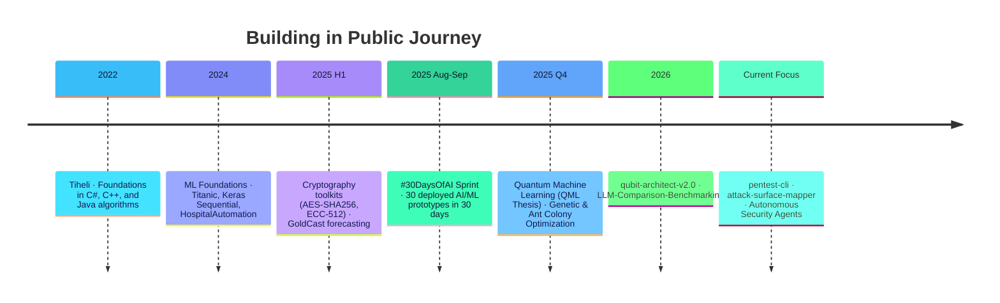

<div align="center">

  <!-- Header Image / Badge Banner -->
  

  <!-- Animated Dynamic Typing -->
  <a href="https://github.com/SuleymanToklu">
    
  </a>

  <p align="center">
    <a href="#-about-me">About Me</a> •
    <a href="#-tech-stack--tooling">Tech Stack</a> •
    <a href="#-featured-projects">Featured Projects</a> •
    <a href="#-featured-architecture--pentest-cli">Architecture</a> •
    <a href="#-github-metrics--activity">Stats</a> •
    <a href="#-t%C3%BCrk%C3%A7e-%C3%B6zet">Türkçe 🇹🇷</a>
  </p>

  <p align="center">
    
    
    
    
  </p>

</div>

---

### 🌐 Connect With Me

<div align="center">

  <a href="https://www.linkedin.com/in/suleyman-toklu10" target="_blank">
    
  </a>
  <a href="https://www.kaggle.com/tiheli" target="_blank">
    
  </a>
  <a href="https://huggingface.co/tiheli" target="_blank">
    
  </a>
  <a href="https://medium.com/@sulotkl" target="_blank">
    
  </a>
  <a href="https://share.streamlit.io/user/tiheli" target="_blank">
    
  </a>
  <a href="mailto:kermittosuleymane@gmail.com">
    
  </a>

</div>

---

### 💡 About Me

```yaml
identity:
  name: Süleyman Toklu
  role: Security-Minded AI Engineer
  degree: Computer Engineering @ Isparta University of Applied Sciences (ISUBÜ)

ethos: "Automate tedious workflows, keep human-in-the-loop decision making, report with clarity."

current_focus:
  - "Building 'pentest-cli': LLM-assisted, phase-by-phase external web pentesting orchestrator"
  - "Developing 'attack-surface-mapper': Low-noise passive/active recon engine reporting in clear Turkish"
  - "Researching Quantum Machine Learning (QML) & Controlled LLM code-generation benchmarks"

milestones:
  - "#30DaysOfAI: 30 distinct AI/ML apps built, trained, and deployed in 30 consecutive days"
```

---

### 🛠️ Tech Stack & Tooling

<div align="center">

#### Programming Languages
<p>
  
</p>

#### AI / ML & Data Science
<p>
  
  
  
  
</p>

#### Web, Mobile & Backend
<p>
  
  
  
</p>

#### Security, Cloud & Infrastructure
<p>
  
  
  
  
</p>

</div>

---

### 🚀 Featured Projects

| Status | Project | Description | Stack | Link |
|:---:|:---|:---|:---|:---:|
|  | **`pentest-cli`** | External web pentest orchestrator. LLM generates actionable rationales for every scan; human approval required before execution. | `Python` `Security` `LLM` | [Inspect Repo ↗](https://github.com/SuleymanToklu/pentest-cli) |
|  | **`attack-surface-mapper`** | Authorized recon engine providing high-signal, low-noise attack surface mapping, generated directly in Turkish. | `Python` `OSINT` `Recon` | [Inspect Repo ↗](https://github.com/SuleymanToklu/attack-surface-mapper) |
|  | **`LLM-Comparison-Benchmarking`** | Controlled benchmark study evaluating four code-generation LLMs against a strict Next.js architectural specification. | `TypeScript` `Python` `Eval` | [Inspect Repo ↗](https://github.com/SuleymanToklu/LLM-Comparison-Benchmarking) |
|  | **`qubit-architect-v2.0`** | Quantum Machine Learning lab comparing classical and quantum ML models side-by-side on uniform datasets. | `TypeScript` `React` `QML` | [Inspect Repo ↗](https://github.com/SuleymanToklu/qubit-architect-v2.0) |
|  | **`Claudeinthehouse`** | End-to-end intelligent laptop recommendation platform analyzing user workload, budget, and legacy device specs. | `FastAPI` `Flutter` `Dart` | [Inspect Repo ↗](https://github.com/SuleymanToklu/Claudeinthehouse) |
|  | **`30-Days-30-Projects`** | Master central repository for the #30DaysOfAI sprint. 30 distinct production-ready AI applications built in 30 days. | `Python` `Jupyter` `Streamlit` | [Inspect Repo ↗](https://github.com/SuleymanToklu/30-Days-30-Projects) |

---

### 🛡️ Featured Architecture — `pentest-cli`

> **Design Principle**: Transparent, controlled external penetration testing with explainable LLM reasoning and mandatory human authorization.

```mermaid
%%{init: {
  "theme": "base",
  "themeVariables": {
    "background": "transparent",
    "primaryColor": "#1e293b",
    "primaryTextColor": "#f8fafc",
    "primaryBorderColor": "#38bdf8",
    "lineColor": "#60a5fa",
    "textColor": "#f8fafc",
    "mainBkg": "#0f172a",
    "nodeBorder": "#38bdf8",
    "clusterBkg": "#1e293b",
    "clusterBorder": "#3b82f6",
    "fontFamily": "ui-monospace, SFMono-Regular, Menlo, Monaco, Consolas, monospace"
  }
}}%%
flowchart LR
    subgraph Scope ["Phase 1: Authorization"]
      A(["🎯 Scope Target<br/>& Written Auth"])
    end

    subgraph Recon ["Phase 2: Discovery"]
      B["🔎 Passive Recon<br/><code>subfinder</code>"]
      C["⚡ Active Recon<br/><code>httpx · nmap</code>"]
    end

    subgraph Analysis ["Phase 3: Vulnerability Intel"]
      D["🛡️ Vuln Assessment<br/><code>nuclei · ffuf</code>"]
      P{{"🧠 LLM Engine<br/>Risk & Execution Rationale"}}
    end

    subgraph Control ["Phase 4: Execution Gate"]
      H[/"✋ Human-in-the-Loop<br/>Strict Review & Sign-off"/]
      R[["📄 Executive Report<br/>Turkish Summary & Remediation"]]
    end

    A --> B
    B --> C
    C --> D
    D --> P
    P --> H
    H -->|Approved| R
    H -->|Revise / Abort| P
```



---

### 📊 GitHub Metrics & Activity

<div align="center">
  <table border="0">
    <tr>
      <td valign="top" width="50%">
        
      </td>
      <td valign="top" width="50%">
        
      </td>
    </tr>
    <tr>
      <td colspan="2" align="center">
        
      </td>
    </tr>
  </table>
</div>

---

### ⏳ Journey & Milestones



---

<details id="türkçe-özet">
<summary><b>🇹🇷 Türkçe Profil Özeti (Genişletmek için tıklayın)</b></summary>
<br/>

### Hakkımda
Isparta Uygulamalı Bilimler Üniversitesi Bilgisayar Mühendisliği öğrencisiyim. **Yapay Zeka & Makine Öğrenimi** ile **Siber Güvenlik** kesişiminde çalışıyor; tekrarlayan ve zaman alan süreçleri otomatize eden, karar mekanizmasında insan denetimini (*Human-in-the-Loop*) merkezde tutan ve çıktıyı anlaşılır bir dille sunan araçlar geliştiriyorum.

#### Odak Alanlarım:
- **`pentest-cli`**: Harici web sızma testlerini aşama aşama yöneten, her taramanın arkasındaki nedeni LLM ile açıklayan ve insan onayı olmadan hiçbir eylem gerçekleştirmeyen güvenlik aracı.
- **`attack-surface-mapper`**: Yetkili harici keşif süreçlerini düşük gürültü ve yüksek doğrulukla haritalayan, raporlamayı doğrudan Türkçe sunan keşif aracı.
- **#30DaysOfAI**: 30 gün boyunca her gün canlıya alınan 30 farklı yapay zeka/makine öğrenmesi projesi.
- **Kuantum Makine Öğrenmesi (QML)**: Klasik ve kuantum ML modellerinin başa baş kıyaslandığı bitirme araştırmaları.

#### İletişim:
- LinkedIn: [suleyman-toklu10](https://www.linkedin.com/in/suleyman-toklu10)
- Kaggle: [tiheli](https://www.kaggle.com/tiheli)
- Hugging Face: [tiheli](https://huggingface.co/tiheli)
- Medium: [@sulotkl](https://medium.com/@sulotkl)
- E-posta: [kermittosuleymane@gmail.com](mailto:kermittosuleymane@gmail.com)

</details>

---

<div align="center">
  <sub>Designed with precision & care for Süleyman Toklu • Updated 2026</sub><br/>
  <a href="https://github.com/SuleymanToklu">
    
  </a>
</div>
