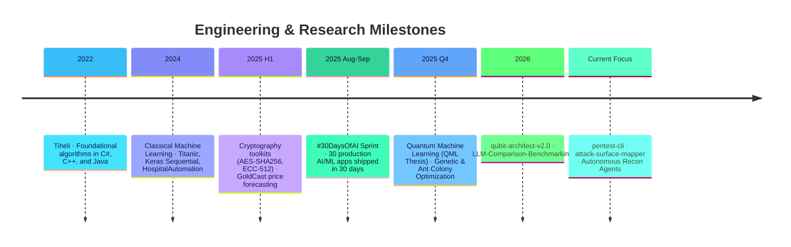

<div align="center">

  <!-- Header Banner -->
  

  <!-- Animated Dynamic Typing -->
  <a href="https://github.com/SuleymanToklu">
    
  </a>

  <br/>

  <p align="center">
    <a href="#-terminal-session">Terminal</a> •
    <a href="#-featured-projects">Projects</a> •
    <a href="#-live-cli-preview">CLI Demo</a> •
    <a href="#-tech-stack--tooling">Tech Stack</a> •
    <a href="#-the-30daysofai-sprint">#30DaysOfAI</a> •
    <a href="#-architecture--pentest-cli">Architecture</a> •
    <a href="#-github-metrics--analytics">Stats</a> •
    <a href="#-t%C3%BCrk%C3%A7e-%C3%B6zet">Türkçe 🇹🇷</a>
  </p>

  <p align="center">
    
    
    
    
    
  </p>

</div>

---

### 🌐 Social & Network Hub

<div align="center">

  <a href="https://www.linkedin.com/in/suleyman-toklu10" target="_blank">
    
  </a>
  <a href="https://www.kaggle.com/tiheli" target="_blank">
    
  </a>
  <a href="https://huggingface.co/tiheli" target="_blank">
    
  </a>
  <a href="https://medium.com/@sulotkl" target="_blank">
    
  </a>
  <a href="https://share.streamlit.io/user/tiheli" target="_blank">
    
  </a>
  <a href="mailto:kermittosuleymane@gmail.com">
    
  </a>

</div>

---

### 💻 Terminal Session

```bash
suleyman@devsecops-lab:~$ whoami
┌─────────────────────────────────────────────────────────────────────────────┐
│  Name: Süleyman Toklu                                                       │
│  Role: Security-Minded AI Engineer                                          │
│  Base: Isparta University of Applied Sciences (ISUBÜ), Computer Engineering │
│  Focus: External Recon Automation, Explainable Pentest AI, Quantum ML       │
└─────────────────────────────────────────────────────────────────────────────┘

suleyman@devsecops-lab:~$ cat core_philosophy.json
{
  "mission": "Automate the tedious recon steps, keep human in the loop, report clearly.",
  "active_initiatives": [
    "pentest-cli -> LLM-assisted, authorized external penetration testing framework",
    "attack-surface-mapper -> High-signal external attack surface mapping in Turkish",
    "qubit-architect-v2.0 -> Comparative Quantum ML vs. Classical ML workbench"
  ],
  "milestone": "#30DaysOfAI -> 30 production AI/ML apps built and shipped in 30 days"
}
```

---

### 🚀 Featured Repositories

<div align="center">
  <table border="0">
    <tr>
      <td width="50%" valign="top">
        <a href="https://github.com/SuleymanToklu/pentest-cli">
          
        </a>
      </td>
      <td width="50%" valign="top">
        <a href="https://github.com/SuleymanToklu/attack-surface-mapper">
          
        </a>
      </td>
    </tr>
    <tr>
      <td width="50%" valign="top">
        <a href="https://github.com/SuleymanToklu/LLM-Comparison-Benchmarking">
          
        </a>
      </td>
      <td width="50%" valign="top">
        <a href="https://github.com/SuleymanToklu/qubit-architect-v2.0">
          
        </a>
      </td>
    </tr>
  </table>
</div>

---

### ⚡ Live CLI Preview — `pentest-cli` & `attack-surface-mapper`

What makes these tools different is **explainable AI execution** combined with **human approval** at every single stage:

```text
$ pentest-cli --target target.example.com --scope authorized_domains.txt --mode assisted

[*] [PHASE 1: PASSIVE RECON]
    Running subfinder & assetfinder...
    [✔] 23 live subdomains discovered across target scope.

[*] [PHASE 2: ACTIVE PROBING]
    Running httpx & selective port telemetry...
    [✔] Active web services identified (Ports: 80, 443, 8080, 8443).

[🧠 LLM AGENT RATIONALE]:
    "Discovered legacy admin portal on staging.target.example.com:8443 with TLSv1.0.
     Recommended scan: Nuclei CVE-2023 / misconfiguration checks.
     No aggressive denial-of-service or payload fuzzing will be used."

[?] ACTION REQUIRED: Approve scan on target port 8443? [y/N]: y
    [➜] Executing Nuclei security template bundle...
    [✔] Scan finalized. Zero unauthorized exploits fired.

[📄 EXPORT]: Turkish Executive Brief saved -> ./reports/2026-09-pentest-summary.md
```

---

### 📦 Key Projects Portfolio

| Status | Project | Purpose & Key Innovation | Stack | Link |
|:---:|:---|:---|:---|:---:|
|  | **[`pentest-cli`](https://github.com/SuleymanToklu/pentest-cli)** | Human-in-the-loop web pentest orchestrator. LLM generates actionable rationale before any tool executes; strict human approval gate. | `Python` `Security` `LLM` | [Repo ↗](https://github.com/SuleymanToklu/pentest-cli) |
|  | **[`attack-surface-mapper`](https://github.com/SuleymanToklu/attack-surface-mapper)** | Low-noise external attack surface mapping engine providing sharp, actionable insights reported in clear Turkish. | `Python` `OSINT` `Recon` | [Repo ↗](https://github.com/SuleymanToklu/attack-surface-mapper) |
|  | **[`LLM-Comparison-Benchmarking`](https://github.com/SuleymanToklu/LLM-Comparison-Benchmarking)** | Controlled comparative evaluation of top code-generation models implementing an identical Next.js full-stack spec. | `TypeScript` `Python` `LLM` | [Repo ↗](https://github.com/SuleymanToklu/LLM-Comparison-Benchmarking) |
|  | **[`qubit-architect-v2.0`](https://github.com/SuleymanToklu/qubit-architect-v2.0)** | Quantum Machine Learning lab comparing classical and quantum variational circuits side-by-side. | `TypeScript` `React` `QML` | [Repo ↗](https://github.com/SuleymanToklu/qubit-architect-v2.0) |
|  | **[`Claudeinthehouse`](https://github.com/SuleymanToklu/Claudeinthehouse)** | FastAPI + Flutter smart recommendation system analyzing computing workloads, budget, and legacy device specs. | `FastAPI` `Flutter` `Dart` | [Repo ↗](https://github.com/SuleymanToklu/Claudeinthehouse) |
|  | **[`30-Days-30-Projects`](https://github.com/SuleymanToklu/30-Days-30-Projects)** | Central directory and documentation for the #30DaysOfAI sprint. 30 distinct AI/ML apps built and deployed in 30 days. | `Python` `Jupyter` `Streamlit` | [Repo ↗](https://github.com/SuleymanToklu/30-Days-30-Projects) |

---

### 🔥 The #30DaysOfAI Challenge Spotlight

> In August-September 2025, I completed **#30DaysOfAI**: 30 distinct AI/ML applications built, trained, and deployed in 30 consecutive days with **zero skips**.

<div align="center">

| Day | Project Name | Technology & Domain | Link |
|:---:|:---|:---|:---:|
| **Day 30** | 🛠️ **AI Swiss Army Knife** | Multi-tool AI suite integrating text, image, and tabular intelligence | [Inspect Day 30 ↗](https://github.com/SuleymanToklu/Day30-AI-Swiss-Army-Knife) |
| **Day 29** | 🎯 **AI-Supported Sniper Lab** | Computer vision targeting analysis & trajectory prediction model | [Inspect Day 29 ↗](https://github.com/SuleymanToklu/Day-29-AI-Supported-Sniper-Lab) |
| **Day 28** | 🔍 **Transformer Explorer** | Interactive attention map visualizer & transformer decoder explorer | [Inspect Day 28 ↗](https://github.com/SuleymanToklu/Day28-Transformer-Explorer) |
| **Day 26** | 🎵 **AI Music Studio** | Audio synthesis & neural music genre composition engine | [Inspect Day 26 ↗](https://github.com/SuleymanToklu/Day26-AI-Music-Studio) |
| **Day 23** | 🎨 **AI Image Generator** | Generative latent diffusion pipeline with interactive prompt tuning | [Inspect Day 23 ↗](https://github.com/SuleymanToklu/Day23-AI-Image-Generator) |
| **Day 14** | 👁️ **YOLO Object Detection** | High-throughput real-time object detection and spatial classification | [Inspect Day 14 ↗](https://github.com/SuleymanToklu/Day14-YOLO-Object-Detection) |

<sub>👉 Explore all 30 standalone repositories on [30-Days-30-Projects](https://github.com/SuleymanToklu/30-Days-30-Projects)</sub>

</div>

---

### 🛡️ Architecture Deep Dive — `pentest-cli`

```mermaid
%%{init: {
  "theme": "base",
  "themeVariables": {
    "background": "transparent",
    "primaryColor": "#1e293b",
    "primaryTextColor": "#f8fafc",
    "primaryBorderColor": "#38bdf8",
    "lineColor": "#60a5fa",
    "textColor": "#f8fafc",
    "mainBkg": "#0f172a",
    "nodeBorder": "#38bdf8",
    "clusterBkg": "#1e293b",
    "clusterBorder": "#3b82f6",
    "fontFamily": "ui-monospace, SFMono-Regular, Menlo, Monaco, Consolas, monospace"
  }
}}%%
flowchart LR
    subgraph S1 ["Phase 1: Authorization"]
      A(["🎯 Scope Target<br/>& Written Auth"])
    end

    subgraph S2 ["Phase 2: Discovery Engine"]
      B["🔎 Passive Recon<br/><code>subfinder · assetfinder</code>"]
      C["⚡ Active Telemetry<br/><code>httpx · nmap</code>"]
    end

    subgraph S3 ["Phase 3: Vulnerability Intel"]
      D["🛡️ Vuln Assessment<br/><code>nuclei · ffuf</code>"]
      P{{"🧠 LLM Agent<br/>Why This Tool? Why Now?"}}
    end

    subgraph S4 ["Phase 4: Human Gate & Report"]
      H[/"✋ Human-in-the-Loop<br/>Review, Approve, or Modify"/]
      R[["📄 Executive Report<br/>Turkish Summary & Remediation"]]
    end

    A --> B
    B --> C
    C --> D
    D --> P
    P --> H
    H -->|Approved| R
    H -->|Revise / Refine| P
```



---

### 🛠️ Tech Stack & Tooling

<div align="center">

#### Languages & Core Scripting
<p>
  
</p>

#### AI / ML & Computational Science
<p>
  
  
  
  
  
</p>

#### Web, Full-Stack & Apps
<p>
  
  
  
</p>

#### Security, Recon & Infrastructure
<p>
  
  
  
  
</p>

</div>

---

### 🏆 GitHub Trophies & Milestones

<div align="center">
  
</div>

---

### 📊 GitHub Metrics & Analytics

<div align="center">
  <table border="0">
    <tr>
      <td valign="top" width="50%">
        
      </td>
      <td valign="top" width="50%">
        
      </td>
    </tr>
    <tr>
      <td colspan="2" align="center">
        
      </td>
    </tr>
    <tr>
      <td colspan="2" align="center">
        
      </td>
    </tr>
  </table>
</div>

---

### ⏳ Building in Public Journey



---

<details id="türkçe-özet">
<summary><b>🇹🇷 Türkçe Profil Özeti & Hakkımda (Genişletmek için tıklayın)</b></summary>
<br/>

### Merhaba, Ben Süleyman Toklu 👋
Isparta Uygulamalı Bilimler Üniversitesi Bilgisayar Mühendisliği öğrencisiyim. **Yapay Zeka (AI/ML)** ve **Siber Güvenlik (DevSecOps & Pentest)** alanlarının kesişiminde çalışıyorum.

Temel mottom: *"Sıkıcı ve tekrarlayan süreçleri otomatize et, karar mekanizmasında insan denetimini (Human-in-the-Loop) merkezde tut ve çıktıları sade, anlaşılır bir dille sun."*

#### 🌟 Öne Çıkan Çalışmalarım & Ar-Ge Odaklarım:
1. **`pentest-cli`**: Harici web sızma testlerini aşama aşama yürüten, her tarama öncesinde LLM desteğiyle *"Neden bu araç? Neden şimdi?"* gerekçesini sunan ve insan onayı olmadan hiçbir zararlı/agresif komut çalıştırmayan güvenlik aracı.
2. **`attack-surface-mapper`**: Yetkili harici saldırı yüzeyini düşük gürültü ve yüksek doğrulukla tarayan, tüm bulguları doğrudan Türkçe raporlayan keşif motoru.
3. **#30DaysOfAI**: 2025 yılında 30 gün boyunca tek bir gün dahi aksatmadan her gün canlıya alınan 30 farklı yapay zeka & makine öğrenimi projesi.
4. **Kuantum Makine Öğrenmesi (QML)**: Bitirme tezim kapsamında klasik makine öğrenmesi modelleri ile kuantum değişken devreli sınıflandırıcıların (VQC) başa baş kıyaslandığı araştırma laboratuvarı (`qubit-architect-v2.0`).
5. **Sezgisel Optimizasyon**: Karınca Kolonisi ve Genetik Algoritmalar ile karmaşık optimizasyon problemlerinin modellenmesi.

#### 📬 İletişim & Ağ:
- LinkedIn: [suleyman-toklu10](https://www.linkedin.com/in/suleyman-toklu10)
- Kaggle: [tiheli](https://www.kaggle.com/tiheli)
- Hugging Face: [tiheli](https://huggingface.co/tiheli)
- Medium: [@sulotkl](https://medium.com/@sulotkl)
- E-posta: [kermittosuleymane@gmail.com](mailto:kermittosuleymane@gmail.com)

</details>

---

<div align="center">
  <p>
    <b>Interested in collaborating or discussing AI & Security?</b><br/>
    <a href="mailto:kermittosuleymane@gmail.com">
      
    </a>
  </p>
  <sub>Engineered with precision for Süleyman Toklu • 2026</sub><br/>
  <a href="https://github.com/SuleymanToklu">
    
  </a>
</div>
